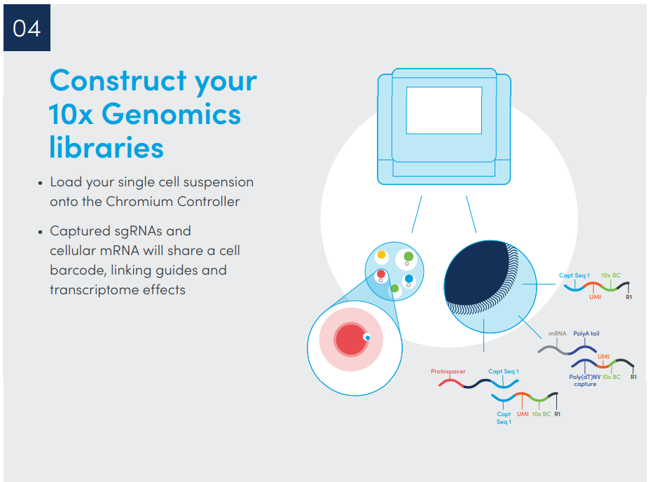
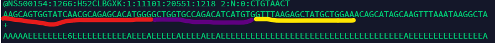
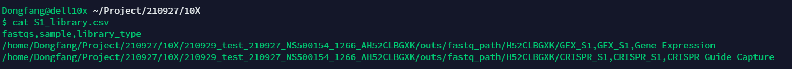
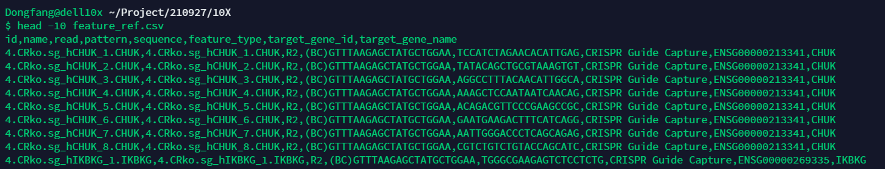
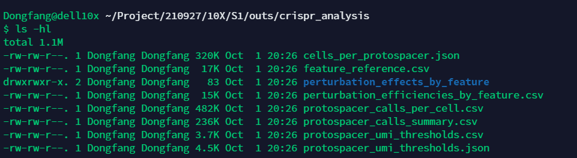
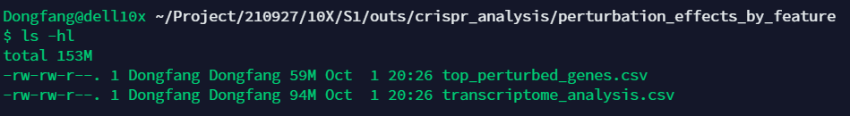

# CRISPR Algorithms Overview

## Pooled CRISPR Screens

Feature Barcode technology may be used to perform pooled CRISPR screens in an efficient and scalable fashion. For an introduction to pooled CRISPR screens, see: Perturb-Seq (Adamson et al., 2016, and Dixit et al., 2016), CRISP-seq (Jaitin et al., 2016), CROP-seq (Datlinger et al., 2017), or CRISPR-QTL (Gasperini et al., 2018). See the Glossary for definitions of terms.

The goal of a pooled CRISPR screen is to use CRISPR to perturb the expression of a list of pre-identified genes and quantitatively measure the effects of those perturbations on the transcriptome of the cells of interest. The cells are typically transfected in a pooled fashion with a number of plasmids that code for guide RNAs that target the pre-selected genes of interest. Since the assay captures both transcripts and transfected guide RNAs from each cell, one can correlate the changes in the transcriptome with the perturbations received by each sub-group of cells.

## Experimental Design

A wide variety of experimental designs are used in pooled CRISPR screens, depending on the nature of the biological questions being investigated and the scope of the experiment. We emphasize three general principles commonly employed in such experiments.

Multiple guide RNAs per target gene. In general, it is hard to predict the functional efficacy of a guide RNA construct purely from its in silico design. In order to mitigate the risk of non-functional guide RNA molecules that do not perturb the expression of their target genes significantly, pooled CRISPR screens typically employ 2-5 guide RNA constructs per target gene.

Non-targeting guide RNAs that function as negative controls. In order to measure the effectiveness of a particular guide RNA construct in perturbing the expression of its target gene, or the effects of such a perturbation on the rest of the transcriptome, one would need to perform a differential expression analysis where the cells expressing the relevant guide RNA(s) are compared with control cells. The experimental design typically includes control guide RNA constructs that are explicitly designed not to target any annotated genes in the reference transcriptome; these guide RNAs are called "non-targeting" guides. The control cells used in the differential expression analyses are typically cells identified as containing only (some combination of) non-targeting guides. In order to account for possible error in the design or transfection of these non-targeting guide RNA constructs, typically more than one such construct (usually 2-5) are used in the experiment.

Carefully designed and validated transfection protocol. Based on the particular transfection protocol used in the assay, the distribution of guide RNA constructs among cells can vary widely, from as few as a median of 1 guide per cell to as high as 15 per cell. The transfection protocol is usually carefully designed based on the requirements imposed by the biological questions of interest, such as the median number of guide RNA constructs per cell or the number of cells required per perturbation of interest. In addition, typically the transfection protocol is validated by some combination of PCR-based techniques and next-generation sequencing (see Methods sections of the References).

## Protospacer Calling
In pooled CRISPR screens, the presence of low levels of ambient guide RNA in solution typically leads to a small number of "background" UMI counts even in cells that do not express any guide RNA constructs. In the Protospacer Calling step, Cell Ranger identifies, for each guide RNA construct specified in the Feature Reference CSV File, the sub-population of cells that express that particular guide RNA significantly above background.

For each guide RNA, Cell Ranger assumes that there are two populations of cells: one that expresses the guide and one that does not. (This latter population only has UMI counts due to ambient guide RNA molecules.) To distinguish these two populations from each other, Cell Ranger fits a Gaussian Mixture Model to the log-transformed Molecules/Cell distribution for the guide RNA in question. This model calculates the probability that a given cell belongs to the population expressing the guide RNA rather than the background population, and uses that probability to identify cells expressing the guide RNA. The algorithm runs independently for each guide RNA specified in the Feature Reference CSV File.

## Perturbation Efficiency and Transcriptome-Wide Effects
In pooled CRISPR screens, two central questions arise. First, to what extent did the expression of the target genes change amongst those cells expressing the guide RNAs that targeted those genes ("Perturbation Efficiency")? Second, what effects did these perturbations have on the transcriptome of those cells ("Perturbation Effects")?

Both questions rely on differential expression analyses. As with Gene Expression, Cell Ranger uses the quick and simple method sSeq (Yu, Huber, & Vitek, 2013) in order to find differentially expressed genes between the perturbed cells and the control cells (cells that only contain guide RNAs designed specifically to be non-targeting). For details on the implementation of sSeq within Cell Ranger, see Gene Expression.

To quantify Perturbation Efficiency, we report the log2-fold-change in the expression of each target gene. To address transcriptome-wide Perturbation Effects, we provide a list of top perturbed genes for each perturbation, in addition to a list of how every gene in the reference transcriptome changed under each perturbation.

Each of the above results are calculated "by feature," where the cells are grouped based on the combinations of guide RNAs they contain, or "by target," where they are grouped based on the combinations of genes targeted by those guide RNAs. (The latter can lead to increased statistical power in cases where each gene is targeted by multiple guides, since cells where the same combinations of genes are perturbed may be grouped together.)


## Experiment
**Important section**


**CRISPR Read2 structure**



Red color: TSO
Purple color: feature barcode (protospacer sequence)
Yellow color: constant sequence in the guide RNA which is used as an anchor to identify the location of protospacer
##Data analysis workflow

**Server: 10.135.25.36**
**Project directory: /home/Dongfang/Project/210927/10X**

### Sample demultiplexing
Cellranger mkfastq
```shell
/home/dongfang/pipeline/10X/cellranger-6.1.1/cellranger mkfastq --id=210929_test_210927_NS500154_1266_AH52CLBGXK \
                     --run=/mnt/bcl/210927_NS500154_1266_AH52CLBGXK \
                     --csv=210927_samplesheet.csv \
```

### CRISPR feature barcode analysis
Cell Ranger processes all Feature Barcode data through a counting pipeline that quantifies each feature in each cell. This analysis is done by the cellranger count pipeline. The pipeline outputs a unified feature-barcode matrix that contains gene expression counts alongside Feature Barcode counts for each cell barcode. The feature-barcode matrix replaces the gene-barcode matrix emitted by older versions of Cell Ranger.

The pipeline first extracts and corrects the cell barcode and UMI from the feature library using the same methods as gene expression read processing. It then then matches the Feature Barcode read against the list of features declared in the Feature Barcode Reference. The counts for each feature are available in the feature-barcode matrix output files and in the Loupe Browser output file.

To enable Feature Barcode analysis, cellranger count needs two new inputs:

Libraries CSV is passed to cellranger count with the --libraries flag, and declares the FASTQ files and library type for each input dataset. In a typical Feature Barcode analysis there will be two input libraries: one for the normal single-cell gene expression reads, and one for the Feature Barcode reads. This argument replaces the --fastqs argument.
Feature Reference CSV is passed to cellranger count with the --feature-ref flag and declares the set of Feature Barcode reagents in use in the experiment. For each unique Feature Barcode used, this file declares a feature name and identifier, the unique Feature Barcode sequence associated with this reagent, and a pattern indicating how to extract the Feature Barcode sequence from the read sequence. See Feature Barcode Reference for details on how to construct the feature reference.
After creating the CSV files, run cellranger count:

```shell
/home/Dongfang/Pipeline/software/cellranger-6.1.1/cellranger count --id=S1 \
                   --libraries=S1_library.csv \
                   --transcriptome=/home/Dongfang/Pipeline/ref_genome/10X/refdata-gex-GRCh38-2020-A \
                   --feature-ref=feature_ref.csv

/home/Dongfang/Pipeline/software/cellranger-6.1.1/cellranger count --id=S2 \
                   --libraries=S2_library.csv \
                   --transcriptome=/home/Dongfang/Pipeline/ref_genome/10X/refdata-gex-GRCh38-2020-A \
                   --feature-ref=feature_ref.csv


/home/Dongfang/Pipeline/software/cellranger-6.1.1/cellranger count --id=S3 \
                   --libraries=S3_library.csv \
                   --transcriptome=/home/Dongfang/Pipeline/ref_genome/10X/refdata-gex-GRCh38-2020-A \
                   --feature-ref=feature_ref.csv


/home/Dongfang/Pipeline/software/cellranger-6.1.1/cellranger count --id=S4 \
                   --libraries=S4_library.csv \
                   --transcriptome=/home/Dongfang/Pipeline/ref_genome/10X/refdata-gex-GRCh38-2020-A \
                   --feature-ref=feature_ref.csv

/home/Dongfang/Pipeline/software/cellranger-6.1.1/cellranger aggr --id=20210927_aggr --csv=aggr_1.csv 
```
**Libraries CSV File**
The Libraries CSV File declares the input FASTQ data for the libraries that make up a Feature Barcode experiment. This will include one library containing Single Cell Gene Expression reads, and one or more libraries containing Feature Barcode reads. To use cellranger count in Feature Barcode mode, you must create a Libraries CSV File and pass it with the --libraries flag. The following table describes what the content should be in the Libraries CSV File.

|Column Name|	Description|
|-----|-------|
|fastqs|	A fully qualified path to the directory containing the demultiplexed FASTQ files for this sample. Analogous to the --fastqs arg to cellranger count. This field does not accept comma-delimited paths. If you have multiple sets of fastqs for this library, add an additional row, and use the use same library_type value.|
|sample|	Same as the --sample arg to cellranger count. Sample name assigned in the bcl2fastq sample sheet.|
|library_type|	The FASTQ data will be interpreted using the rows from the feature reference file that have a ‘feature_type’ that matches this library_type. This field is case-sensitive, and must match a valid library type as described in the Library / Feature Types section. Must be Gene Expression for the gene expression libraries. (This includes Targeted Gene Expression.) Must be one of Custom, Antibody Capture, or CRISPR Guide Capture for Feature Barcode libraries.|




**Feature Reference CSV File**
A Feature Reference CSV File is required when processing Feature Barcode data. It declares the molecule structure and unique Feature Barcode sequence of each feature present in your experiment. Each line of the CSV declares one unique Feature Barcode. The Feature Reference CSV File is passed to cellranger count with the --feature-ref flag. Please note that the CSV may not contain characters outside of the ASCII range.

Targeted Gene Expression data is compatible with Feature Barcode analysis. However, if Targeted Gene Expression data is analyzed in conjunction with CRISPR-based Feature Barcode data, there are additional requirements imposed for the Feature Reference CSV file. Specifically, any CRISPR guide RNA target genes (in the target_gene_id column of the Feature Reference CSV file) must correspond to genes which are also included in the targeted gene expression Target Panel CSV file (in the gene_id column).

This table describes the columns in the Feature Reference CSV File. 

|Column Name|	Description|
|-------|-------|
|id|	Unique ID for this feature. Must not contain whitespace, quote or comma characters. Each ID must be unique and must not collide with a gene identifier from the transcriptome.|
|name|	Human-readable name for this feature. Must not contain whitespace. This name will be displayed in Loupe Browser.|
|read|	Specifies which RNA sequencing read contains the Feature Barcode sequence. Must be R1 or R2. Note: in most cases R2 is the correct read.|
|pattern|	Specifies how to extract the Feature Barcode sequence from the read. See the Barcode Extraction Pattern section below for details.|
|sequence|	Nucleotide barcode sequence associated with this feature. E.g., antibody barcode or sgRNA protospacer sequence.|
|feature_type|	Type of the feature. See the Library/Feature Types section for details on allowed values of this field. FASTQ data specified in the Library CSV File with a library_type that matches the feature_type will be scanned for occurrences of this feature. Each feature type in the feature reference must match a library_type entry in the Libraries CSV File. This field is case sensitive.|
|target_gene_id|	(Optional) Reference gene identifier of the target gene of a CRISPR guide RNA. A gene with this id must exist in the reference transcriptome. Providing target_gene_id and target_gene_name will enable the pipeline to perform differential expression analysis, assuming that control ("Non-Targeting") guides are also specified. Non-targeting guides must contain the value "Non-Targeting" in the target_gene_id and target_gene_name fields. See the CRISPR Overview section for more details.|
|target_gene_name|	(Optional) Gene name of target gene of a CRISPR guide RNA. The gene name corresponding to the gene referenced in the target_gene_id field must match the gene name given here. See the CRISPR Overview section for more details.|

**Feature Barcode Extraction Pattern**
The pattern field of the feature reference defines how to locate the Feature Barcode within a read. The Feature Barcode may appear at a known offset with respect to the start or end of the read or may appear at a fixed position relative to a known anchor sequence. The pattern column can be made up of a combination of these elements:

- 5P: denotes the beginning of the read sequence. May appear 0 or 1 times, and must be at the beginning of the pattern. Only 5P or 3P may appear, not both. (^ may be used instead of 5P.)
- 3P: denotes the end of the read sequence. May appear 0 or 1 times, and must be at the end of the pattern. ($ may be used instead of 3P.)
- N: denotes an arbitrary base.
- A, C, G, T: denotes a fixed base that must match the read sequence exactly.
- (BC): denotes the Feature Barcode sequence as specified in the sequence column of the feature reference. Must appear exactly once in the pattern.


Any constant sequences made up of A, C, G and T in the pattern must match exactly in the read sequence. Any N in the pattern is allowed to match a single arbitrary base. A modest number of fixed bases should be used to minimize the chance of a sequencing error disrupting the match. The fixed sequence should also be long enough to uniquely identify the position of the Feature Barcode. For feature types that require an non-N anchor, we recommend 12bp-20bp of constant sequence. The extracted Feature Barcode sequences are corrected up to a Hamming distance of 1 using the 10x barcode correction algorithm that is used to correct cell barcodes.

**CRISPR Guide Capture**
In CRISPR Guide Capture assays, the Feature Barcode sequence is the CRISPR protospacer sequence. The protospacer is followed by a downstream constant sequence in the guide RNA which is used as an anchor to identify the location of the protospacer. We recommend using a 12bp-20bp constant sequence that can be uniquely identified, but is short enough that it is unlikely to be disrupted by a sequencing error. In the example Feature Reference CSV file we declare six guide RNA features with six distinct barcode / protospacer sequences. We use the target_gene_id and target_gene_name columns to declare the target gene of each guide RNA, for use in downstream CRISPR perturbation analysis. Two guides are declared with target_gene_id as Non-Targeting. Cells containing Non-Targeting guides will be used as controls for CRISPR perturbation analysis. The four remaining guides target two genes.

|read|	pattern|
|-----|-------|
|R2|	(BC)GACCAGGATGGGCACCACCC|


### Seurat analysis
https://satijalab.org/seurat/articles/mixscape_vignette.html
https://kkorthauer.org/fungeno2019/singlecell/vignettes/1.2-preprocess-droplet.html#1_overview

##CRISPR Metrics
Cell Ranger computes sequencing quality and application results metrics on each supported library, which currently are Antibody Capture, CRISPR Guide Capture, and Custom (user-defined assays that are neither Antibody nor CRISPR). These metrics will be computed and displayed only when one of these library types was used in the assay. This page describes CRISPR library metrics for QC of the library prep and sequencing of CRISPR libraries, which appear in the metrics_summary.csv file and on the web_summary.html page.

|Metric|	Description|
|---------|----|
|CRISPR: Number of Reads|	Total number of reads from the CRISPR library.|
|CRISPR: Mean Reads per Cell|	The total number of reads from the CRISPR library divided by the number of barcodes associated with cell-containing partitions.|
|CRISPR: Valid Barcodes|	Fraction of reads from the CRISPR library with a cell-barcode found in or corrected to one that is found in the whitelist.|
|CRISPR: Sequencing Saturation|	Fraction of CRISPR library reads originating from an already-observed UMI. This is a function of library complexity and sequencing depth. More specifically, this is a ratio where: the denominator is the number of reads with a recognized protospacer sequence, valid cell-barcode, and valid UMI, and the numerator is the subset of those reads that had a non-unique combination of (cell-barcode, UMI, protospacer sequence).|
|CRISPR: Q30 Bases in Barcode|	Fraction of cell barcode bases from the CRISPR library with Q-score >= 30, excluding very low quality/no-call (Q <= 2) bases from the denominator.|
|CRISPR: Q30 Bases in RNA Read|	Fraction of bases from the read containing the protospacer with Q-score >= 30, excluding very low quality/no-call (Q <= 2) bases from the denominator. This is Read 2 for the Single Cell 3' v3 and Single Cell 5' chemistries.|
|CRISPR: Q30 Bases in Sample Index|	Fraction of sample index bases from the CRISPR library with Q-score >= 30, excluding very low quality/no-call (Q <= 2) bases from the denominator.|
|CRISPR: Q30 Bases in UMI|	Fraction of UMI bases in the CRISPR library with Q-score >= 30, excluding very low quality/no-call (Q <= 2) bases from the denominator.|
|CRISPR: Fraction Reads with Putative Protospacer Sequence|	Fraction of reads from the CRISPR library from which a putative protospacer sequence could be extracted, as per the patterns specified in the Feature Definition File. For example, if the specified pattern is "20 bases upstream of sequence X", this metric specifies the fraction of reads containing sequence X and 20 bases upstream of it.|
|CRISPR: Fraction Guide Reads|	Fraction of reads from the CRISPR library with a recognized protospacer sequence.|
|CRISPR: Fraction Guide Reads Usable|	Fraction of reads from the CRISPR library with a recognized protospacer sequence, a valid UMI, and a cell-associated barcode.|
|CRISPR: Guide Reads Usable per Cell|	Number of guide reads usable divided by the number of cell-associated barcodes.|
|CRISPR: Fraction Protospacer Not Recognized|	Among all reads from the CRISPR library from which a putative protospacer sequence could be extracted, the fraction with a protospacer sequence that was not recognized.|
|CRISPR: Guide Reads in Cells|	Among reads from the CRISPR library with a recognized protospacer sequence, a valid UMI, and a valid barcode, the fraction associated with cell-containing partitions.|
|CRISPR: Cells with 1 or more protospacers detected|	Cells identified by the protospacer-calling algorithm as expressing 1 or more protospacers.|
|CRISPR: Cells with 2 or more protospacers detected|	Cells identified by the protospacer-calling algorithm as expressing 2 or more protospacers.|
|CRISPR: Median UMIs per Cell|	Median UMIs per Cell (summed over all recognized protospacers).|
|CRISPR: Valid UMIs|	Fraction of reads with valid UMIs; i.e. UMI sequences that do not contain Ns and that are not homopolymers.|
|CRISPR: Number of Short Reads Skipped|	Total number of read pairs that were ignored by the pipeline because they do not satisfy the minimum length requirements (for example Read-1 less that 26 bases in 3' v2 or 3' v3 or 5').|


##CRISPR Output Files


Cell Ranger outputs certain files that are specific to the CRISPR analysis. We briefly describe each file in the crispr_analysis sub-folder.




**cells_per_protospacer.json**

A JSON object of (key, value) pairs, where each key is a protospacer name and the corresponding value is a list of all cell barcodes in which that protospacer was detected.

```
{
    "GFP": [
        "AAACCCAAGCCGTTAT-1", 
        "AAACCCATCTCAAAGC-1", 
        "AAACGAACATTGCTTT-1", 
        "AAACGCTAGCCGATCC-1", 
        "AAAGAACAGAACAGGA-1",
        ...
    ], 
    "Control_1": [
        "AAACCCAAGCCGTTAT-1", 
        "AAACGAACACCCTGAG-1", 
        "AAACGAACAGTTGTCA-1", 
        "AAACGAAGTATTCCTT-1", 
        "AAACGAAGTCTGTCAA-1",
        ...
```

**protospacer_calls_per_cell.csv**
A CSV file containing four columns: cell barcode, number of features (protospacers) detected in that cell, the names of detected feature(s), and the number of molecules (UMIs) for each feature in that cell. In the event that there are multiple features for a cell_barcode, the corresponding multiple entries for feature_call and num_umis will be separated by a | character.
```
$ head -3 protospacer_calls_per_cell.csv
cell_barcode,num_features,feature_call,num_umis
TGTCCTGCACCAGTTA-1,1,GFP,1085
CTCCGATAGACTCATC-1,1,GFP,1466
```
**protospacer_calls_summary.csv**
A CSV file containing five columns: a category (combination of protospacers or a particular property, like that of having no guide molecules detected), the number of cell barcodes belonging to that category, the percentage of cell barcodes in that category, the median UMI counts aggregated over protospacer(s) in the category (if any), and the standard deviation of UMI counts aggregated over protospacer(s) in the category (if any). In particular, we include the following 2 categories: "No guide molecules", which refers to cells where no guide molecules were detected, and "No confident call" which refers to cells where either no guide molecules were detected or the number of detected guide molecules were not judged by the protospacer-calling algorithm to be significantly different from the background.
```
$ head protospacer_calls_summary.csv 
protospacer_call,num_cells,pct_cells,median_umis,stddev_umis
No guide molecules,0,0.0,None,None
No confident call,538,11.2,None,None
1 protospacer expressed,4214,87.72,None,None
More than 1 protospacer expressed,52,1.08,None,None
GFP,2059.0,42.86,1345.0,1480.621745859537
GFP - Control_1,52.0,1.08,2015.5,2072.675627903681
Control_1,2155.0,44.86,1001.0,1815.816097039266
```


**protospacer_umi_thresholds.csv**

A CSV file containing two columns: the protospacers used in the experiment, and the minimum number of molecules (umi_count) a cell needs to possess in order to be classified as expressing that protospacer.
```
$ head -3 protospacer_umi_thresholds_csv.csv
protospacer, umi_threshold
GFP,120
Control_1,79
```
**protospacer_umi_thresholds.json**

The same as the file above, only in JSON format.

##Output Files That Rely on Differential Expression Analysis

The output files described below are only produced if the Feature Reference file includes at least 1 Non-Targeting guide RNA. These output files rely on differential expression analysis, which requires the presence of control cells (those that receive only Non-Targeting guide RNAs). For more information on Non-Targeting guide RNAs, please see CRISPR Algorithms Overview section.



**perturbation_efficiencies_by_feature.csv**
This CSV file summarizes the effectiveness of the guide RNAs in perturbing their targets. The cells are grouped "by feature" i.e. combinations of guides present. The following columns are present:

|Column	|Brief Description|
| -----------| -----------|
|Perturbation|	Combinations of guide RNAs present.|
|Target Guide|	The guide RNA whose target gene is being considered for the perturbation efficiency calculation.|
|Log2 Fold Change|	The log2 fold change in expression of the target gene, relative to control cells.|
|p Value|	p-value for the hypothesis test.|
|Log2 Fold Change Lower Bound|	Lower confidence bound (5th percentile) for Log2 Fold Change.|
|Log2 Fold Change Upper Bound|	Upper confidence bound (95th percentile) for Log2 Fold Change.|
|Cells with Perturbation|	Number of cells with this perturbation i.e. this combination of guide RNAs.|
|Mean UMI Count Among Cells with Perturbation|	Mean UMI count for the target gene in question, among cells with this combination of guide RNAs.|
|Cells with Non-Targeting Guides|	Number of control cells i.e cells with only non-targeting guide RNAs.|
|Mean UMI Count Among Cells with Non-Targeting Guides|	Mean UMI count for the target gene in question, among control cells.|

An example is provided below:
```
$ head -3 perturbation_efficiencies_by_feature.csv 
Perturbation, Target Guide, Log2 Fold Change, p Value, Log2 Fold Change Lower Bound, Log2 Fold Change Upper Bound, Cells with Perturbation, Mean UMI Count Among Cells with Perturbation, Cells with Non-Targeting Guides, Mean UMI Count Among Cells with Non-Targeting Guides
Guide1|Guide2   Guide1 -2.487458049, 0.684604341, -3.8938847, -1.591207405, 37, 0.189189189, 3760, 1.199734043  
Guide1|Guide2   Guide2 1.46887148, 0.273153378, -0.206506878, 2.354657695, 37, 0.054054054, 3760, 0.028723404
```
**perturbation_efficiencies_by_target.csv**

This CSV file is very similar to perturbation_efficiencies_by_feature.csv, with the only difference being that cells are grouped "by target" i.e. combinations of genes that their guide RNAs are targeting.
```
$ head -4 perturbation_efficiencies_by_target.csv 
Perturbation, Target Gene, Log2 Fold Change, p Value, Log2 Fold Change Lower Bound, Log2 Fold Change Upper Bound, Cells with Perturbation, Mean UMI Count Among Cells with Perturbation, Cells with Non-Targeting Guides, Mean UMI Count Among Cells with Non-Targeting Guides
Gene1, Gene1, -3.742386941, 5.98E-07, -4.869624021, -2.7417221, 942, 0.001061571, 3760, 0.028723404
Gene2|Gene1, Gene2, -3.006368897, 0.666629078, -3.080612608, -2.920975978, 34, 0, 3760, 0.23643617
Gene2|Gene1, Gene1, 0.023108305, 1, -0.197392057, 0.283497989, 34, 0, 3760, 0.028723404
```
**perturbation_effects_by_feature/top_perturbed_genes.csv**

This CSV file lists the top 10 genes from the reference transcriptome that showed the greatest increase or decrease in expression as a result of each perturbation detected in the experiment. For each perturbation, the results are presented in 4 columns; the results for multiple perturbations are juxtaposed together. These columns are: the (human-readable) name of the gene, the Gene ID, the log2 fold change in expression, and the adjusted p-value (corrected for multiple comparisons).

**perturbation_effects_by_feature/transcriptome_analysis.csv**

This CSV file lists the effects of each perturbation on each gene in the reference transcriptome. Each row is specific to a gene: the first column specifies the Gene ID and the second column specifies the human-readable gene name. The subsequent columns summarize how the expression of each gene changes under each perturbation (combinations of guide RNAs). The results from each perturbation are summarized by 3 columns: mean UMI counts for that gene under that perturbation, log2 fold change relative to the expression in control cells, and adjusted p-value for this comparison. The results from different perturbations are juxtaposed with each other.

**perturbation_effects_by_target/top_perturbed_genes.csv**
This CSV file is very similar to perturbation_effects_by_feature/top_perturbed_genes.csv, with the only difference being that cells are grouped "by target" i.e. combinations of genes that their guide RNAs are targeting.

**perturbation_effects_by_target/transcriptome_analysis.csv**
This CSV file is very similar to perturbation_effects_by_feature/transcriptome_analysis.csv, with the only difference being that cells are grouped "by target" i.e. combinations of genes that their guide RNAs are targeting.

##References
Yu, D., Huber, W. amd Vitek, O. Shrinkage estimation of dispersion in Negative Binomial models for RNA-seq experiments with small sample size. Bioinformatics 29, 1275–1282 (2013).

Adamson, B., Norman, T., Jost, M., Cho, M., Nunez, J., Chen, Y., Villalta, J., Gilbert, L., Horlbeck, M., Hein, M., Pak, R., Gray, A., Gross, C., Dixit, A., Parnas, O., Regev, A., and Weissman, J. A multiplexed single-cell CRISPR screening platform enables systematic dissection of the unfolded protein response. Cell 167, 1867-1882 (2016).

Dixit, A., Parnas, O., Li, B., Chen, J., Fulco, C., Jerby-Arnon, L., Marjanovic, N., Dionne, D., Burks, T., Raychowdhury, R., Adamson, B., Norman, T., Lander, E., Weissman, J., Friedman, N., and Regev, A. Perturb-Seq: Dissecting molecular circuits with scalable single-cell RNA profiling of pooled genetic screens. Cell 167, 1853–1866 (2016).

Jaitin, D., Weiner, A., Yofe, I., Lara-Astiaso, D., Keren-Shaul, H., David, E., Meir Salame, T., Tanay, A., van Oudenaarden, A., and Amit, I. Dissecting Immune Circuits by Linking CRISPR-Pooled Screens with Single-Cell RNA-Seq. Cell 167, 1883–1896 (2016).

Datlinger, P., Rendeiro, A., Schmidl, C., Krausgruber, T., Traxler, P., Klughammer, J., Schuster, L., Kuchler, A., Alpar, D., and Bock, C. Pooled CRISPR screening with single-cell transcriptome readout. Nature Methods 14, 297–301 (2017).

Gasperini, M., Hill, A., McFaline-Figueroa, J., Martin, B., Trapnell, C., Ahituv, N., and Shendure, J. crisprQTL mapping as a genome-wide association framework for cellular genetic screens. bioRxiv 314344, doi: https://doi.org/10.1101/314344 (2018).
